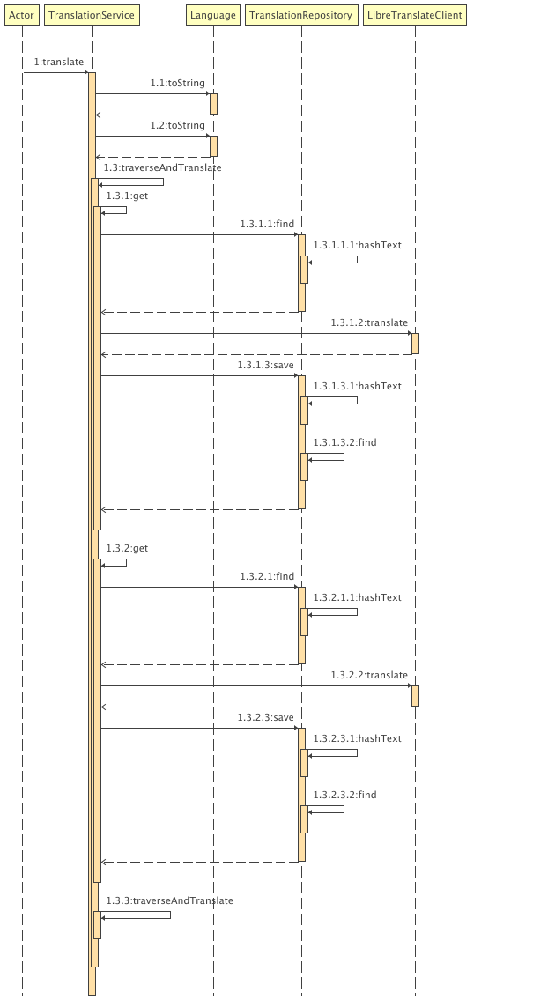

# Wells Kiosk - Setup & Usage Guide

## Table of Contents

* [Prerequisites](#prerequisites)
* [Installation & Setup](#installation--setup)
* [Running the Application](#running-the-application)
* [Environment Variables (Visa Payment)](#environment-variables-visa-payment)
* [Admin Panel](#admin-panel)

    * [Accessing Admin Panel](#accessing-admin-panel)
    * [Creating & Editing Products](#creating--editing-products)
    * [Managing Translations](#managing-translations)
    * [Restaurant Settings](#restaurant-settings)
    * [Managing Coupons](#managing-coupons)
* [Customer Experience](#customer-experience)

    * [Ordering a Product](#ordering-a-product)
    * [Theme Switching (Dark Mode)](#theme-switching-dark-mode)
    * [Changing Language](#changing-language)
* [Asset Specifications](#asset-specifications)
* [Additional Notes](#additional-notes)

---

## Prerequisites

* **Docker** (ensure it's installed and running)
* **Java** and **Gradle**
* Optional: **Braintree Account** (for VISA payment support)

---

## Installation & Setup

1. **Clone the repository** and navigate to the project directory:

   ```bash
   git clone <your-repo-url>
   cd wells-kiosk
   ```

2. **Run Docker Compose:**

   ```bash
   docker-compose up
   ```

   Make sure all containers start successfully. Note that the translation service (`libra`) may take up to **1–2 hours** to warm up.

3. **Initialize the database:**

    * Access your database (via CLI, GUI, or container).
    * Run the SQL file located at `kiosk.sql` to initialize tables and seed data.

4. **Run the application:**

   ```bash
   cd wells-kiosk
   ./gradlew run
   ```

   Alternatively, run the main class directly from your IDE.

---

## Environment Variables (Visa Payment)

To enable **Visa card payments** via Braintree:

1. Create a `.env` file in the root directory:

   ```
   MERCHANT_ID=your_merchant_id
   PAYPAL_PRIVATE_ID=your_private_key
   PAYPAL_PUBLIC_KEY=your_public_key
   ```

2. Without a `.env` file, you can still use the **"Free Pay"** button on the checkout page for testing purposes.

---

## Admin Panel

### Accessing Admin Panel

1. On the **home page**, press `Shift + A`.
2. Login using:

    * **Username:** `root`
    * **Password:** `root`

### Creating & Editing Products

1. On the admin dashboard, click **"Create Product"**.
2. Enter product details:

    * **Image**
    * **Name**
    * **Ingredients**
    * **Tags** (used as categories)
3. Press **"Create/Save"** to add the product.

To **edit** a product:

* Navigate to the product list on the admin page.
* Click the **edit icon** on a product card.
* Make changes and save.

To **delete** a product:

* Click the **`X`** icon on the respective product card.

### Managing Translations

1. On the admin sidebar, click **"Translation"**.

2. Select the **target language**.

3. Click **"Cache Translations"** to prefetch and store translations for visited pages.

   > ⚠️ Only pages you’ve visited will have translations available for caching.

4. To manually edit a translation:

    * Click a translation from the table.
    * Modify the value at the bottom.
    * Click **"Save Translation"**.

### Restaurant Settings

* Click **"Settings"** from the admin sidebar.
* Modify restaurant information:

    * Name
    * Contact details
    * Location
    * Logo
* Save your changes.

### Managing Coupons

1. Click **"Coupons"** from the admin sidebar.
2. Enter:

    * Coupon code
    * Discount percentage
3. Click **"Save"** to add it.
4. To delete a coupon, click the **"Delete"** button next to it.

---

## Customer Experience

### Ordering a Product

1. Choose **Eat In** or **Take Out** on the home page.

2. Select a product (e.g., burger).

3. On the product page:

    * View and customize ingredients and sides.
    * Set quantity and click **"Add to Cart"**.

4. Proceed to **Checkout**:

    * Modify cart items if needed.
    * Choose **Receipt** or **No Receipt**:

        * *Receipt*: includes full details.
        * *No Receipt*: shows order number and order type only.

5. Choose a **payment method**:

    * **Visa** (requires environment variables)
    * **Free Pay** (for testing)

6. After payment:

    * Enter a **personal number** to log in as a member (optional).
    * Leave **feedback** by selecting stars.
    * A receipt is shown, then it will auto-return to the home page.
    * If logged in, **points** are allocated (used in another system).

---

## Theme Switching (Dark Mode)

* On the **top-right** of the home page, click the **theme toggle** to switch between **light** and **dark mode**.

---

## Changing Language

* On the **bottom-left** of the home page:

    * Use the **language combo box** to select your preferred language.

---

## Asset Specifications

To maintain visual consistency, adhere to the following asset dimensions:

* **Standard Product Image Size:** `400 x 350` pixels
* **Standard Campaign Banner Size:** `600 x 300` pixels

Ensure all images are optimized for fast loading and appropriate aspect ratios.

---

## Additional Notes

* Translations depend on pages being visited before they can be cached.
* Points earned through membership are assumed to be redeemed in a separate system.
* Make sure the translation service has **ample warm-up time** before caching translations. 
* Membership sign-up and point usage are managed in a separate system, not through this kiosk.

---

## UML Diagrams

This section provides visual representations of key system interactions and structure.

### Sequence Diagrams

#### 1. Application Start-up Sequence

This diagram illustrates the flow of control when the application starts, including service initialization.


---

#### 2. Translation Service Sequence

This diagram represents the behavior of the translation service when a user has a language set to something other than English.



---

#### 3. Adding Product to Order

This diagram shows the interaction flow when a customer adds a product to their order from the product details view.


---

#### 4. Payment Handling Flow

This diagram shows how the `PaymentController` handles payment requests and processes transactions.


---

### Class Diagram

This diagram provides an overview of the core classes in the system, including their attributes and relationships.

